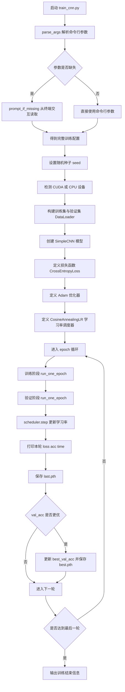
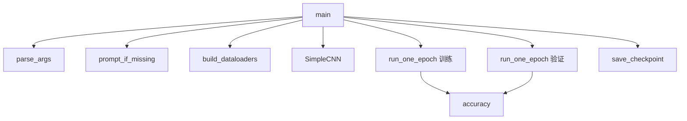

# CNN 训练流程图与原理图

本文档对应脚本 `train_cnn.py`，用于说明该 `CNN` 分类模型从数据读取、前向传播、损失计算、反向传播到参数更新的完整过程。

## 1. 整体训练总流程图



## 2. 数据流动流程图

```mermaid
flowchart LR
    A[CIFAR-10 原始图片] --> B[RandomCrop 随机裁剪]
    B --> C[RandomHorizontalFlip 随机水平翻转]
    C --> D[ToTensor 转张量]
    D --> E[Normalize 标准化]
    E --> F[DataLoader 按批次加载]
    F --> G[images shape: B x 3 x 32 x 32]
    G --> H[送入 SimpleCNN]
    H --> I[输出 logits shape: B x 10]
    I --> J[CrossEntropyLoss 与 labels 计算损失]
    J --> K[训练时反向传播]
    K --> L[Adam 更新参数]
```



## 3. CNN 网络结构原理图

下面这张图描述 `SimpleCNN` 的前向传播结构，以及每层大致张量形状变化。

```mermaid
flowchart TD
    A[输入图像\n3 x 32 x 32] --> B[Conv2d 3->64\n3x3 padding=1]
    B --> C[BatchNorm2d 64]
    C --> D[ReLU]
    D --> E[Conv2d 64->64\n3x3 padding=1]
    E --> F[BatchNorm2d 64]
    F --> G[ReLU]
    G --> H[MaxPool2d 2x2]
    H --> I[Dropout 0.25]
    I --> J[特征图\n64 x 16 x 16]

    J --> K[Conv2d 64->128\n3x3 padding=1]
    K --> L[BatchNorm2d 128]
    L --> M[ReLU]
    M --> N[Conv2d 128->128\n3x3 padding=1]
    N --> O[BatchNorm2d 128]
    O --> P[ReLU]
    P --> Q[MaxPool2d 2x2]
    Q --> R[Dropout 0.25]
    R --> S[特征图\n128 x 8 x 8]

    S --> T[Conv2d 128->256\n3x3 padding=1]
    T --> U[BatchNorm2d 256]
    U --> V[ReLU]
    V --> W[Conv2d 256->256\n3x3 padding=1]
    W --> X[BatchNorm2d 256]
    X --> Y[ReLU]
    Y --> Z[AdaptiveAvgPool2d 1x1]
    Z --> AA[特征图\n256 x 1 x 1]
    AA --> AB[Flatten]
    AB --> AC[Linear 256->256]
    AC --> AD[ReLU]
    AD --> AE[Dropout]
    AE --> AF[Linear 256->10]
    AF --> AG[输出 logits\n10 类分数]
```



## 4. 训练阶段详细流程图

```mermaid
flowchart TD
    A[开始一个 epoch] --> B[从 DataLoader 取出一个 batch]
    B --> C[images 和 labels 移动到 device]
    C --> D{是否为训练模式}
    D -->|是| E[开启梯度计算]
    D -->|否| F[关闭梯度计算]
    E --> G[model(images) 前向传播]
    F --> G[model(images) 前向传播]
    G --> H[criterion(outputs, labels) 计算损失]
    H --> I{是否为训练模式}
    I -->|是| J[optimizer.zero_grad 清空梯度]
    J --> K[loss.backward 反向传播]
    K --> L[optimizer.step 更新参数]
    I -->|否| M[跳过反向传播]
    L --> N[统计 batch loss 和 batch acc]
    M --> N[统计 batch loss 和 batch acc]
    N --> O{是否还有下一个 batch}
    O -->|有| B
    O -->|无| P[计算整轮平均 loss 和 acc]
    P --> Q[返回本轮结果]
```

## 5. 反向传播原理图


## 6. 各模块详细原理说明

### 6.1 输入数据部分

- 数据集使用 `CIFAR-10`，每张图片是 `32 x 32` 的彩色图像，因此输入通道数为 `3`。
- 训练集执行数据增强：
  - `RandomCrop(32, padding=4)`：先在边缘补零，再随机裁剪，增强平移鲁棒性。
  - `RandomHorizontalFlip()`：随机水平翻转，增强左右方向变化的适应能力。
- 验证集不做随机增强，只做张量化和标准化，保证评估结果稳定。
- `Normalize(mean, std)` 的作用是把不同通道的数据分布拉到更适合神经网络训练的范围，从而加快收敛速度。

### 6.2 卷积层原理

- 卷积层的本质是使用多个可学习卷积核，在输入特征图上滑动提取局部模式。
- 第一层卷积通常学习边缘、角点、纹理等低级特征。
- 更深层卷积会在前面特征基础上组合出更复杂的形状、区域和语义模式。
- 在本模型中，卷积核大小使用 `3x3`，这是经典 CNN 中非常常见的配置。
- `padding=1` 的作用是让卷积前后空间尺寸保持一致，避免特征图过快缩小。

### 6.3 BatchNorm 原理

- `BatchNorm2d` 会对一个 batch 内同一通道的特征做归一化。
- 它可以缓解训练过程中的分布漂移问题，让网络更稳定。
- 它通常还能允许使用更大的学习率，并提高训练速度。
- 在卷积层后接 `BatchNorm + ReLU` 是非常常见的结构。

### 6.4 ReLU 原理

- `ReLU(x) = max(0, x)`。
- 它的作用是引入非线性能力，使网络能够拟合复杂函数。
- 如果没有非线性激活，多层线性层叠加后本质上仍然只是线性变换。
- ReLU 计算简单、效果稳定，因此在 CNN 中非常常见。

### 6.5 池化层原理

- `MaxPool2d(2, 2)` 会在每个 `2x2` 区域里取最大值。
- 它能降低特征图尺寸，减少计算量和参数敏感性。
- 同时它保留了更强的局部响应，常用于提取更稳定的重要特征。
- 在本模型中，两次最大池化让特征图从 `32x32` 依次变成 `16x16`、`8x8`。

### 6.6 Dropout 原理

- `Dropout` 会在训练时随机将一部分神经元输出置零。
- 这样可以阻止模型过分依赖某些局部特征，降低过拟合风险。
- 卷积块中的 `Dropout(0.25)` 偏弱一些，主要用于特征层正则化。
- 分类器中的 `Dropout(dropout)` 更直接作用于全连接层，进一步提高泛化能力。

### 6.7 AdaptiveAvgPool2d 原理

- `AdaptiveAvgPool2d((1, 1))` 会把任意空间大小的特征图压缩成 `1x1`。
- 对当前网络来说，输入到这里时是 `256 x 8 x 8`，输出会变成 `256 x 1 x 1`。
- 这样做可以把每个通道的空间信息汇聚成一个全局统计量。
- 这一步还能减少全连接层参数量，让模型更简洁。

### 6.8 全连接分类器原理

- `Flatten` 把 `256 x 1 x 1` 展平成长度为 `256` 的向量。
- 第一个 `Linear(256, 256)` 学习全局特征组合关系。
- 最后一个 `Linear(256, 10)` 输出 10 个类别对应的分数。
- 这里输出的是 `logits`，不是概率。
- 在经过 `CrossEntropyLoss` 时，内部会自动结合 `softmax` 思想完成概率比较与损失计算。

### 6.9 交叉熵损失原理

- `CrossEntropyLoss` 适合多分类任务。
- 它会鼓励正确类别的分数更高，错误类别的分数更低。
- 如果模型对正确类别越自信，损失通常越小。
- 如果模型把错误类别分得更高，损失就会更大。

### 6.10 反向传播原理

- 前向传播后得到损失 `loss`。
- `loss.backward()` 会根据链式法则，从输出层开始逐层向前计算梯度。
- 每一层参数都会得到一个对应的梯度，表示“参数微小变化对损失的影响程度”。
- 梯度越大，说明这个参数对当前误差的贡献越明显。

### 6.11 Adam 优化器原理

- `Adam` 是一种自适应学习率优化算法。
- 它综合了梯度一阶矩估计与二阶矩估计。
- 相比普通 SGD，Adam 往往在初期收敛更快，对学习率没有那么敏感。
- 在这个脚本里，CNN 使用 Adam 来简化训练过程并提升收敛稳定性。

### 6.12 学习率调度器原理

- `CosineAnnealingLR` 会让学习率按余弦曲线逐步减小。
- 训练前期学习率较大，有利于快速搜索参数空间。
- 训练后期学习率较小，有利于收敛到更稳定的结果。
- 这种策略常用于图像分类任务。

## 7. 训练时张量形状变化示意

```mermaid
flowchart LR
    A[B x 3 x 32 x 32] --> B[B x 64 x 32 x 32]
    B --> C[B x 64 x 32 x 32]
    C --> D[B x 64 x 16 x 16]
    D --> E[B x 128 x 16 x 16]
    E --> F[B x 128 x 16 x 16]
    F --> G[B x 128 x 8 x 8]
    G --> H[B x 256 x 8 x 8]
    H --> I[B x 256 x 8 x 8]
    I --> J[B x 256 x 1 x 1]
    J --> K[B x 256]
    K --> L[B x 256]
    L --> M[B x 10]
```



## 8. 脚本中各函数职责流程图



## 9. 一句话总结整个 CNN 工作原理

整个 `CNN` 脚本的核心思想是：先把图像做标准化与增强，然后用多层卷积逐步提取从低级到高级的视觉特征，再通过全连接层输出类别分数，最后利用交叉熵损失和反向传播不断更新参数，使模型在 `CIFAR-10` 上获得更高的分类准确率。
