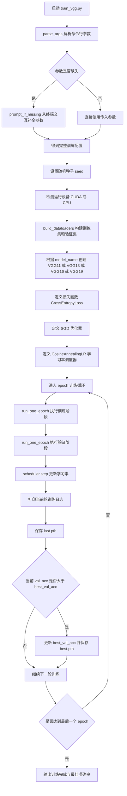
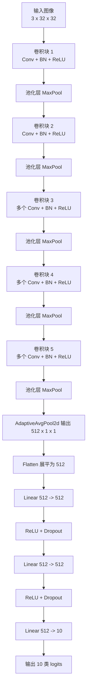
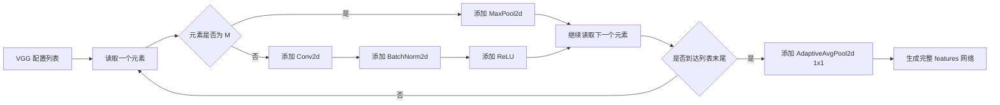
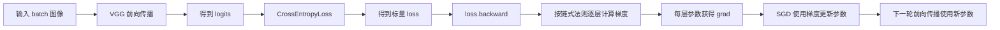
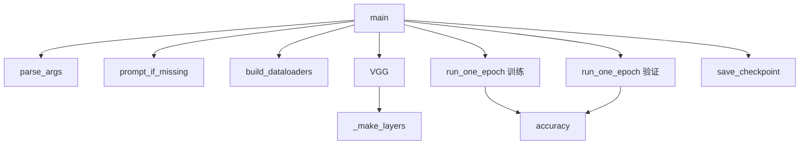
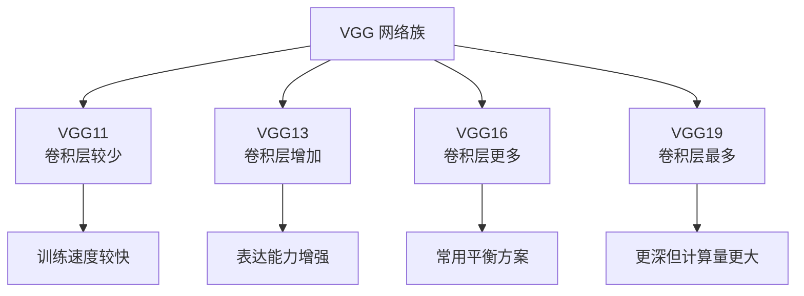

# VGG 训练流程图与原理图

本文档对应脚本 `train_vgg.py`，用于系统说明 `VGG` 网络在 `CIFAR-10` 数据集上的完整训练过程、网络结构组成、前向传播原理、反向传播原理以及参数更新流程。

## 1. VGG 整体训练总流程图



## 2. 输入数据流动流程图

```mermaid
flowchart LR
    A[CIFAR-10 原始图像] --> B[RandomCrop 随机裁剪]
    B --> C[RandomHorizontalFlip 随机翻转]
    C --> D[ToTensor 转换为张量]
    D --> E[Normalize 标准化]
    E --> F[DataLoader 按 batch 加载]
    F --> G[输入张量 B x 3 x 32 x 32]
    G --> H[VGG 特征提取层]
    H --> I[AdaptiveAvgPool2d 变为 1x1]
    I --> J[Flatten 展平]
    J --> K[Classifier 全连接分类器]
    K --> L[输出 logits B x 10]
    L --> M[CrossEntropyLoss 计算损失]
    M --> N[训练阶段执行反向传播]
    N --> O[SGD 更新模型参数]
```



## 3. VGG 网络总结构原理图

`train_vgg.py` 支持 `VGG11`、`VGG13`、`VGG16`、`VGG19` 四种结构，它们的核心思想一致：不断堆叠 `3x3` 卷积层，用池化层降低分辨率，再通过全连接层完成分类。



## 4. VGG16 详细结构流程图

因为默认脚本中常用 `VGG16`，下面给出 `VGG16` 的详细层级箭头结构图。

```mermaid
flowchart TD
    A[输入\n3 x 32 x 32] --> B[Conv 3->64]
    B --> C[BN]
    C --> D[ReLU]
    D --> E[Conv 64->64]
    E --> F[BN]
    F --> G[ReLU]
    G --> H[MaxPool]
    H --> I[特征图\n64 x 16 x 16]

    I --> J[Conv 64->128]
    J --> K[BN]
    K --> L[ReLU]
    L --> M[Conv 128->128]
    M --> N[BN]
    N --> O[ReLU]
    O --> P[MaxPool]
    P --> Q[特征图\n128 x 8 x 8]

    Q --> R[Conv 128->256]
    R --> S[BN]
    S --> T[ReLU]
    T --> U[Conv 256->256]
    U --> V[BN]
    V --> W[ReLU]
    W --> X[Conv 256->256]
    X --> Y[BN]
    Y --> Z[ReLU]
    Z --> AA[MaxPool]
    AA --> AB[特征图\n256 x 4 x 4]

    AB --> AC[Conv 256->512]
    AC --> AD[BN]
    AD --> AE[ReLU]
    AE --> AF[Conv 512->512]
    AF --> AG[BN]
    AG --> AH[ReLU]
    AH --> AI[Conv 512->512]
    AI --> AJ[BN]
    AJ --> AK[ReLU]
    AK --> AL[MaxPool]
    AL --> AM[特征图\n512 x 2 x 2]

    AM --> AN[Conv 512->512]
    AN --> AO[BN]
    AO --> AP[ReLU]
    AP --> AQ[Conv 512->512]
    AQ --> AR[BN]
    AR --> AS[ReLU]
    AS --> AT[Conv 512->512]
    AT --> AU[BN]
    AU --> AV[ReLU]
    AV --> AW[MaxPool]
    AW --> AX[特征图\n512 x 1 x 1]

    AX --> AY[AdaptiveAvgPool 1x1]
    AY --> AZ[Flatten]
    AZ --> BA[Linear 512->512]
    BA --> BB[ReLU]
    BB --> BC[Dropout]
    BC --> BD[Linear 512->512]
    BD --> BE[ReLU]
    BE --> BF[Dropout]
    BF --> BG[Linear 512->10]
    BG --> BH[输出 logits]
```



## 5. VGG 配置表原理图

脚本中的 `VGG_CONFIGS` 使用列表动态描述网络结构，其中：

- 数字表示卷积层输出通道数。
- `"M"` 表示插入一个最大池化层。



## 6. 单个 epoch 的训练流程图

```mermaid
flowchart TD
    A[开始一个 epoch] --> B[从 train_loader 读取一个 batch]
    B --> C[images labels 移动到 device]
    C --> D[前向传播 outputs = model(images)]
    D --> E[计算损失 loss = criterion(outputs, labels)]
    E --> F[optimizer.zero_grad 清空梯度]
    F --> G[loss.backward 反向传播]
    G --> H[optimizer.step 更新参数]
    H --> I[统计当前 batch loss 和 acc]
    I --> J{是否还有下一批数据}
    J -->|是| B
    J -->|否| K[计算整个训练轮次平均 loss 和 acc]
    K --> L[返回 train_loss train_acc]
```

## 7. 单个 epoch 的验证流程图

```mermaid
flowchart TD
    A[开始验证阶段] --> B[model.eval 切换评估模式]
    B --> C[从 val_loader 读取一个 batch]
    C --> D[images labels 移动到 device]
    D --> E[关闭梯度计算]
    E --> F[前向传播 outputs = model(images)]
    F --> G[计算损失]
    G --> H[统计 batch loss 和 acc]
    H --> I{是否还有下一批数据}
    I -->|是| C
    I -->|否| J[计算整个验证轮次平均 loss 和 acc]
    J --> K[返回 val_loss val_acc]
```

## 8. 反向传播与参数更新原理图



## 9. 张量尺寸变化原理图

以下以 `VGG16` 为例，说明典型张量尺寸变化过程：

```mermaid
flowchart LR
    A[B x 3 x 32 x 32] --> B[B x 64 x 32 x 32]
    B --> C[B x 64 x 32 x 32]
    C --> D[B x 64 x 16 x 16]
    D --> E[B x 128 x 16 x 16]
    E --> F[B x 128 x 16 x 16]
    F --> G[B x 128 x 8 x 8]
    G --> H[B x 256 x 8 x 8]
    H --> I[B x 256 x 8 x 8]
    I --> J[B x 256 x 8 x 8]
    J --> K[B x 256 x 4 x 4]
    K --> L[B x 512 x 4 x 4]
    L --> M[B x 512 x 4 x 4]
    M --> N[B x 512 x 4 x 4]
    N --> O[B x 512 x 2 x 2]
    O --> P[B x 512 x 2 x 2]
    P --> Q[B x 512 x 2 x 2]
    Q --> R[B x 512 x 2 x 2]
    R --> S[B x 512 x 1 x 1]
    S --> T[B x 512]
    T --> U[B x 512]
    U --> V[B x 512]
    V --> W[B x 10]
```



## 10. VGG 各组成模块原理详解

### 10.1 为什么 VGG 使用大量 3x3 卷积

- `VGG` 的核心设计思想之一，是使用多个连续的 `3x3` 小卷积核代替大卷积核。
- 例如两个连续的 `3x3` 卷积，其感受野接近一个 `5x5` 卷积，但参数量更少。
- 多层小卷积之间夹着非线性激活函数，因此表达能力更强。
- 这让网络能够更细致地逐层提取图像特征。

### 10.2 卷积层原理

- 卷积层会让多个卷积核在输入图像或特征图上滑动。
- 每个卷积核负责提取一种局部模式，比如边缘、纹理、形状或组合结构。
- 网络浅层通常提取简单特征，深层逐渐提取复杂语义特征。
- 在 VGG 中，随着层数增加，通道数通常会增大，表示网络学习到的特征种类更多。

### 10.3 BatchNorm 原理

- `BatchNorm2d` 对每个通道的特征做批归一化处理。
- 它能降低训练时不同层输入分布变化带来的不稳定问题。
- 同时可以提升训练速度，并使梯度传播更加平稳。
- 在这个脚本里，卷积层后面都接了 `BatchNorm + ReLU`，有利于稳定训练。

### 10.4 ReLU 原理

- `ReLU` 会把负值压成 0，保留正值。
- 这样能够为网络引入非线性表达能力。
- 没有激活函数的话，多层线性变换最终还是一个线性变换。
- ReLU 计算快、梯度传播效果较好，因此深度卷积网络常用它。

### 10.5 最大池化层原理

- `MaxPool2d(2, 2)` 会在每个 `2x2` 区域里取最大值。
- 这能减少特征图尺寸，降低后续计算量。
- 同时，池化还能让特征对微小平移更鲁棒。
- VGG 通过多次池化逐步缩小空间尺寸，保留更抽象的高层特征。

### 10.6 AdaptiveAvgPool2d 原理

- 在卷积层全部结束后，脚本使用 `AdaptiveAvgPool2d((1, 1))`。
- 这一步会把每个通道上的空间特征压缩到 `1x1`。
- 也就是说，输出变成 `512 x 1 x 1`。
- 这样就可以方便地接入全连接分类器。
- 同时这种方式也能减少固定输入尺寸依赖，提高结构通用性。

### 10.7 分类器原理

- `Flatten` 先把 `512 x 1 x 1` 展平成长度为 `512` 的向量。
- 随后经过两层 `Linear(512, 512)`，在高维语义空间中进行特征组合。
- 每层线性层后面接 `ReLU + Dropout`，增强表达能力并抑制过拟合。
- 最后一层 `Linear(512, 10)` 输出 10 个类别的 logits。

### 10.8 Dropout 原理

- `Dropout` 会在训练阶段随机丢弃一部分神经元输出。
- 这样可以减少特征之间的共适应现象。
- 简单理解，就是不让模型过分依赖某几个固定通路。
- 在 VGG 的分类器中加入 Dropout，是经典做法之一。

### 10.9 交叉熵损失原理

- 该脚本使用 `CrossEntropyLoss` 处理多分类任务。
- 它会比较模型输出 logits 与真实标签之间的差异。
- 模型对真实类别预测越准确，损失越小。
- 模型把错误类别打分越高，损失就越大。

### 10.10 反向传播原理

- 前向传播结束后会得到一个标量损失 `loss`。
- `loss.backward()` 会基于链式法则，从输出层向前逐层计算梯度。
- 每个卷积核参数、每个全连接层权重，都会得到对应梯度。
- 梯度表示“参数如何变化会让损失减小”。

### 10.11 SGD 优化器原理

- 本脚本使用 `SGD + momentum + nesterov`。
- `SGD` 表示沿梯度下降方向更新参数。
- `momentum` 用于累积历史更新方向，减小震荡并加速收敛。
- `Nesterov` 动量则在普通动量基础上进一步改进更新方向估计。
- `weight_decay` 相当于 L2 正则化，有助于抑制模型过拟合。

### 10.12 学习率调度器原理

- `CosineAnnealingLR` 会让学习率随着训练轮次呈余弦曲线下降。
- 训练初期学习率较大，有助于快速搜索参数空间。
- 训练中后期学习率逐渐减小，有助于更稳定地逼近最优解。
- 这是一种图像分类任务中很常见的调度策略。

## 11. train_vgg.py 中函数职责流程图



## 12. VGG11 VGG13 VGG16 VGG19 差异流程说明图



## 13. 一句话总结 VGG 的工作原理

VGG 的核心思想就是通过大量连续的 `3x3` 卷积层逐步提取从低级到高级的视觉特征，再通过池化层压缩空间尺寸，最后把高层特征送入全连接分类器，并借助交叉熵损失、反向传播、SGD 和学习率调度器不断更新参数，从而在图像分类任务中得到更高的准确率。
